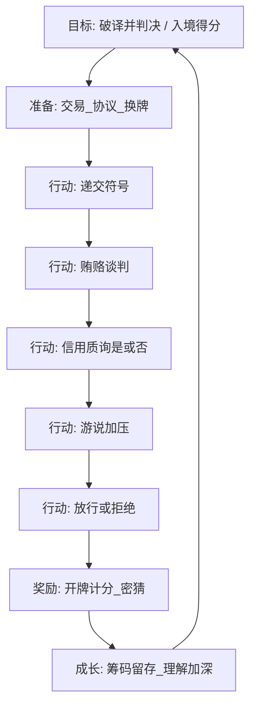

# 《符号边境》桌游策划案（GDD 格式）

> 基于《符号边境》完整设计总纲 v1.0 梳理。  
> 详细规则、秘则对照表、法令全文见：[`符号边境-完整设计总纲.md`](符号边境-完整设计总纲.md)

---

## 1. Game Identity / Mantra（一句话定位）

**无人说谎的边境：用别人听不懂的诚实符号，赌过每日法令与名额刀锋。**

设计决策检验句：若某机制依赖「撒谎」或「跳过破译直接猜身份」，则与 Mantra 冲突，应删改。

---

## 2. Design Pillars（设计支柱，最多 3）

| 支柱 | 玩家应感到的情绪 / 体验 |
|---|---|
| **诚实的迷雾** | 对方句句属实，却仍看不透；推理焦虑来自语言不互通，而非被骗。 |
| **名额下的交易** | 贿赂、背刺、游说都真实存在，但永远压不过「符号破译」这条主线。 |
| **公职的残忍** | 当检查员时既要正确判决，又必须在名额不足时拒绝合规者——对的也可能残忍。 |

**支柱用法**：新功能若不同时服务其中至少一条，视为 scope creep。

---

## 3. Genre（类型与对标，含桌游「3C」）

### 3.1 类型标签

- 主类型：**社交推理 / 不对称角色轮替桌游**
- 副类型：轻经济交易、合规判决、个人竞技计分
- 人数：3–4（正式）；时长：25–40 分钟
- 对标品类：Party + Strategy 中间带（有嘴炮，但结算靠系统）

### 3.2 桌游版「3C」映射

视频游戏 3C = Character / Camera / Control。本桌游对应为：

| 3C | 本游戏对应 |
|---|---|
| **Character（角色）** | 每轮不对称座位：**检查员** vs **入境者**；每人局内必当一次检查员。角色由档案（合规/违规）+ 秘则逻辑域（定居/迁徙/互助）构成。 |
| **Camera（视角）** | 无镜头；信息视角 = **公共桌面**（法令、打出的符号、风险标记、公开谈判）+ **私密手牌/秘则/档案**（挡板后）。 |
| **Control（操控）** | 实体交互：打牌、递筹码、提问「是/否」、宣布放行/拒绝、放置风险标记。发言通道受规则句式限制。 |

### 3.3 三个对标竞品

| 竞品 | 对标层 | 我们借什么 | 我们故意不同 |
|---|---|---|---|
| **《第一类接触》**（Dixit 系语义 / 语言破译灵感；亦可对标《Codenames》的「共同概念、不同解读」） | 底层破译 | 无私语通则无法直译；诚实线索仍产生歧义 | 我们是**多人对每人独立私语法**，且绑定入境判决与计分，而非纯合作猜词 |
| **《诺丁汉警长》** | 中层博弈 | 贿赂、索贿、收钱不保证放行、轮替权力位、交易背刺 | 袋子内容换成**符号语言破译**；禁止用贿赂当合法判决依据；个人竞技总分 |
| **《Papers, Please》**（主题对标；桌游可对标《Bureaucracy》类合规压力或《The Grizzled》式压力决策） | 顶层压力 | 每日法令变更、误判惩罚、公职道德压力 | 落成多人桌面：法令公开可执行算法 + 名额上限制造「正确却残忍」 |

> 一句话品类定位：**「会说话的诺丁汉 × 不能直译的第一类接触 × 每天换法的 Papers Please」**。

---

## 4. Story & Characters（故事与角色）

### 4.1 Story Synopsis（故事梗概）

边境口岸接通多种异族文明。各族没有通用文字，只用古老几何符号组合，表达自身对「世界如何分类」的私有逻辑。帝国法令每日改写准入条款：今日或许欢迎定居与互助，明日则严打迁徙与火种。

旅客必须打出符号申请入境，却不能解释含义。当值检查员只能消耗有限「信用」提问公共概念——「是否包含果实？」——而回答永远诚实。诚实并不能消除误解：同一枚圆，在定居逻辑里可能是河流与石门，在迁徙逻辑里可能是道路与航行。

名额永远不够。合规者也要排队、行贿、防游说；违规者赌检查员破译失败。协议可以达成，也可以背刺。轮替之后，昨日的入境者成为今日的检查员——每个人都尝过刀刃的两端。

最终留下的不是「谁更会说谎」，而是谁更懂在迷雾里做判断，并在筹码与分数上活到最后。

### 4.2 角色设定

#### 角色原型 A｜检查员（轮替公职）

- **职责**：对照本轮公开法令，通过符号质询破译入境者私语言，在名额限制下做出放行/拒绝。  
- **资源**：信用筹码（提问）、可收受的通用贿赂、风险标记的心理压力。  
- **压力**：误放违规重罚（受贿更重）；零质询判决额外惩罚；名额迫使拒绝部分合规者。  
- **情绪弧线**：从「我要公正」到「我必须选择牺牲谁」。

#### 角色原型 B｜入境者（本轮申请方）

- **表层身份**：合规（定居庇护族群）或违规（迁徙游牧族群）。  
- **深层语言**：秘则逻辑域——定居 S / 迁徙 M / 互助 H；符号→概念对照表私密。  
- **可做**：递交符号、行贿、与其他入境者交易/换牌、游说干扰对手、遵守诚实是/否。  
- **不可做**：说谎、解释符号、直宣身份、把贿赂当作「必放凭证」。

#### 角色关系（非固定阵营）

- **无固定队**：纯个人计分；桌上联盟皆为临时协议。  
- **结构对抗**：检查员 ↔ 全体入境者；入境者 ↔ 入境者（名额、游说）。  
- **信息对抗**：每人私语法互相不可套用。

---

## 5. Mechanics Summary（机制总览）

### 5.1 游戏是什么（玩法一句话）

一轮一人当检查员，其余人打出私密语言下的符号申请入境；检查员用有限提问诚实破译，并在贿赂、游说与名额压力下判决；轮换至每人当过检查员，总分最高者胜。

### 5.2 基本规则

#### 玩家能做什么

| 角色 | 行动 |
|---|---|
| 入境者 | 准备阶段交易筹码、换符号、订口头协议；打出 1–2 符号；行贿；对他人发动游说；如实答是/否 |
| 检查员 | 索贿/收贿；消耗信用按固定句式提问；宣布放行/拒绝；轮末密猜逻辑域 |
| 全员 | 跨轮保留通用筹码；终局按比例兑分 |

#### 玩家不能做什么

- 说谎或拒答合法质询  
- 直问身份 / 逻辑域 / 能否入境  
- 用通用词典翻译他人符号  
- 零破译纯赌运气（可做但强惩罚）  
- 超过名额放行  
- 游说时解读符号或剧透推理  

#### 游戏如何结束 / 胜负

- **结束**：完成 = 玩家人数 的轮次（每人当过一次检查员）。  
- **胜利**：个人总分最高；同分比检查员正确判决次数；再同分共享胜。  
- **无团队胜负、无提前淘汰出局**（单轮可 0 分，但不坐牢出局）。

### 5.3 数值系统（桌游资源 = 「生命/法力」等价物）

| 数值 | 作用 | 基准（v1.0） |
|---|---|---|
| **总分** | 胜负唯一标尺 | 多来源累计（入境/检查/兑换） |
| **通用筹码** | 贿赂、游说、交易、终局兑分 | 起始 6（3 人）/ 5（4 人）；终局 3 兑 1 分 |
| **信用筹码** | 检查员提问次数 | 每轮 3；问 1 次耗 1；同人最多问 2 次 |
| **放行名额** | 硬约束 | 3 人局每轮 1；4 人局每轮 2 |
| **符号手牌** | 表达载体 | 每轮抽 3，打 1–2 |
| **风险标记** | 游说心理压力 | 每目标每轮最多 1 枚 |

无传统 HP/MP/等级；「成长」体现在跨轮筹码积累与玩家对系统理解加深（元成长）。

### 5.4 「物理系统」（桌游物理交互）

- **碰撞/占位**：符号区、贿款区、风险标记区、公开法令区——空间分区即状态机。  
- **可见性**：正面朝上 = 公共信息；挡板后 = 私密信息。  
- **同时开牌**：轮末统一揭示，避免逐个开牌造成信息差结算。  
- 无弹道/重力；「物理」= 组件摆放与揭示时序。

### 5.5 经济系统

- **产生**：开局发放；检查员收贿从入境者转移；无系统无中生有（游说费进银行回收）。  
- **消耗**：游说付银行 2；提问耗信用（轮末回收）。  
- **交易**：玩家间自由，协议无强制力。  
- **通胀控制**：总筹码池固定约 40；终局兑换率 3:1 降低囤币碾压；贿赂不创造分，只转移与加风险。

### 5.6 「AI 系统」（无人电脑 AI；规则即裁判 AI）

本作为纯真人桌游，**规则书 + 法令算法**承担「系统 AI」：

- **法令决策树**：逻辑域 ∈ 禁止域 → 应拒；∈ 允许域 → 查特殊条款 → 应允/应拒。  
- **发牌一致性**：档案颜色必须与法令算法结果一致（禁止真随机导致自相矛盾）。  
- **非法提问拒答协议**：句式不符则不耗信用、必须重问。  
- 无路径寻找；「决策树」印在法令卡三行模板上。

### 5.7 编码因果（机制内核，简表）

```
打出符号 --(私密秘则 Tag)--> 概念集合 Σ
Σ + 公开法令 --(算法)--> 应允 / 应拒
档案颜色 ≡ 应允/应拒（发牌约束）
检查员判决 vs 档案 --> 计分
```

质询句式唯一：  
「你的符号所描述的特征，是否包含〔公共概念〕？」→ 答是/否（是否 ∈ Σ）。

> **v1.1**：开牌结算身份 = 逻辑域 + Σ 特殊条款之完整算法；文书发牌色可与结算身份分离（详见总纲 10.5.1）。名额为上限非指标。完整可验算对局见《符号边境-四人对局推演》。

### 5.8 游戏循环（Gameplay Loop）

#### 核心循环（单轮，每名检查员重复一次）



| 循环节 | 内容 |
|---|---|
| **目标** | 入境者：合规入境 / 违规偷渡 / 游说得分；检查员：正确判决 + 少误判 |
| **行动** | 递交、贿赂、提问、游说、判决 |
| **奖励** | 即时无分；轮末统一开牌给分；密猜破译加分 |
| **成长** | 通用筹码跨轮积累；玩家对法令与提问效率的理解提升 |

#### 次要循环

- **交易环**：准备阶段换牌/筹码，服务核心环的信息与名额战。  
- **终局兑换环**：整局结束后筹码→分，拉长经济博弈寿命。  
- **角色轮替环**：权力位转换，防止单一座位永久优势。

#### 单局宏循环

开局组建 → 重复「核心循环 × 人数」→ 终局兑换 → 比较总分。

---

## 6. Features / USP（独特卖点）

1. **全程禁止说谎**：欺骗完全来自「私语法不互通」——品类稀缺卖点。  
2. **三重融合无割裂**：破译（第一类接触）× 贿赂（诺丁汉）× 法令压力（Papers Please）。  
3. **收贿不保证放行**：修掉「行贿=自爆」经典漏洞；合规者也行贿制造迷雾。  
4. **名额刀锋**：即使多人合规也必须淘汰——合规内卷、零和博弈。  
5. **权力轮替绝对公平**：每人当一次检查员；个人竞技无卧底队。  
6. **贿赂/游说非法化判决依据**：保证符号破译永远是主线。  
7. **可执行编码闭环**：秘则对照表 + 法令算法 + 发牌一致性，可直接做原型。  
8. **分层体验**：新手玩交易名额；熟手玩破译；高手玩「正确的残忍」与受贿道德风险。

---

## 7. Interface（交互界面）

> 桌游 UI = 桌面分区 + 组件可读性 + 发言协议 + 记分反馈。

### 7.1 玩家输入方式（Controls）

| 输入 | 方式 |
|---|---|
| 选择符号 | 从手牌抽出 1–2 张，正面置于个人申请区 |
| 贿赂 | 将通用筹码推入检查员贿款区（可私下） |
| 质询 | 口述固定句式 + 从公开概念池点名一词；支付 1 信用 |
| 回答 | 口述「是」或「否」 |
| 游说 | 付 2 通用给银行 + 放置风险标记 + 固定台词 |
| 判决 | 口述「放行」或「拒绝」（可用令牌翻面辅助） |
| 密猜 | 写下/放置逻辑域标记，开牌后揭示 |
| 记分 | 积分表记录，或公共记分板拨数 |

### 7.2 信息显示（Information Display）

| 层级 | 内容 |
|---|---|
| **公共 HUD** | 本轮法令卡、剩余名额、检查员剩余信用、已打出符号、风险标记、概念池表 |
| **私密 HUD** | 秘则卡、档案、未打出符号手牌、个人筹码 |
| **结算 HUD** | 轮末同时开档案/秘则；记分表更新 |

### 7.3 界面类型对应

| 类型 | 在本游戏中的体现 |
|---|---|
| Non-Diegetic | 积分表、规则书、概念池公开表 |
| Diegetic | 法令公示牌、符号卡、边境窗口式申请区、筹码 |
| Spatial | 桌面分区（申请区 / 贿款区 / 法令区 / 弃牌库） |
| Meta | 风险标记（叙事上是「检举」；规则上是心理 UI） |

### 7.4 反馈与参与感

- **听觉**：固定台词形成仪式感（「我申请入境。」「此人存在风险…」）。  
- **视觉**：绿/红档案开牌瞬间；信用减少的紧张感。  
- **社交反馈**：谈判表情与沉默本身是界面的一部分。  

### 7.5 设计原则

- **清晰**：法令必须三行模板（允许域/禁止域/特殊条款），拒绝长叙事。  
- **无障碍**：符号用高对比几何形，不只依赖颜色；档案除颜色外加图标。  
- **效率**：合法提问句式印在检查员辅助卡上，降低规则争议。  
- **沉浸**：美术偏边境关卡文书 + 异族符号碑文；UI 不破坏「无人说谎」的冷峻感。

---

## 8. Art Style（美术风格）

### 8.1 总体方向

**「冷峻关卡文书 × 异族碑文符号」**  
不是奇幻卡通派对风，也不是纯现实海关写实；介于官僚压迫感与古代文明符号学之间。

### 8.2 关键词

- 边境、印章、档案夹、褪色公文纸  
- 几何圣符、石刻、笼统剪影的异族轮廓（不具体种族歧视指向）  
- 低饱和、灰绿/沙石/墨色；合规绿与违规红作**功能色**而非装饰彩虹  

### 8.3 分组件建议

| 组件 | 风格 |
|---|---|
| 法令卡 | 公文版式、关防印、三行信息层级极大 |
| 秘则卡 | 手感像私人石板拓片；背面统一，正面对照表清晰如字典 |
| 符号卡 | 大面积单符号、无装饰噪音，保证隔位可读 |
| 概念池表 | 桌面中央垫图或独立板，图标+文字双编码 |
| 筹码 | 信用=官方徽章质感；通用=通行金属币 |
| 风险标记 | 小旗或火漆「疑」印 |

### 8.4 明确避免

- 过度 Q 版/表情包社交派对视觉（会削弱 Papers Please 压力）  
- 霓虹赛博或泛紫 AI 默认渐变  
- 符号过度复杂导致 3–4 人隔桌不可辨  

### 8.5 情绪板一句话

**打开盒子像领到一套会咬人的边境文书工具，而不是一副热闹的酒桌牌。**

---

## 附录｜与详细规则文档的关系

| 本策划案章节 | 详细落点 |
|---|---|
| Mantra / Pillars / USP | 指导取舍；冲突时以总纲铁则与编码为准 |
| Mechanics 数值与循环 | 总纲第七–十一、九节 |
| 秘则 12 张 / 法令 6 张全文 | 总纲第十节 |
| 双人/硬核变体 | 总纲附录 A/B |

**文档版本**：策划案 GDD 格式 v1.1 · 对齐机制总纲 v1.1 · 附四人对局推演
